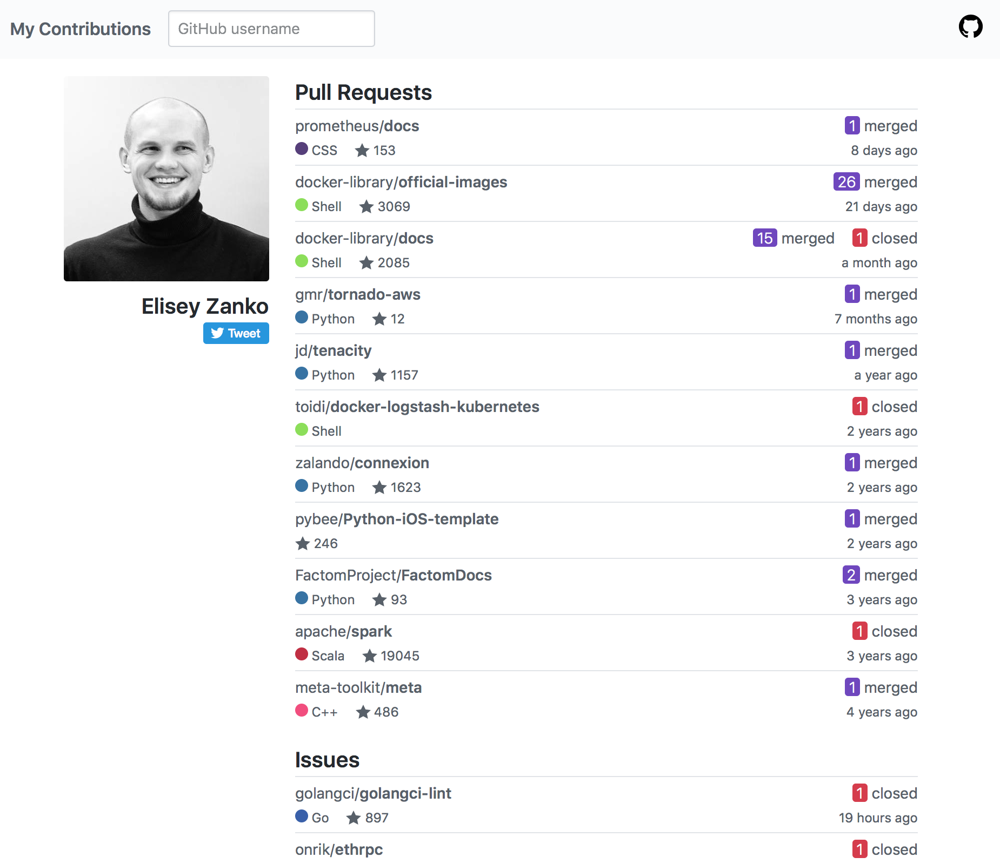

# My Contributions

[My Contributions](https://my-contributions.github.io) represents a simple aggregated view of all pull requests and issues a GitHub user ever created. It includes only repositories that are now owned by the user.

<h6 align="center">
    Example: <a href="https://my-contributions.github.io/?author=31z4">Elisey Zanko</a>
</h6>

We found such information helpful when reviewing job candidates GitHub profiles. You can also include a link to your contributions into your CV.

## Contributing

Contributions are greatly appreciated. The project follows the typical GitHub pull request model. Before starting any work, please either comment on an existing issue or file a new one.

## License

This project is licensed under the MIT License - see the [LICENSE](LICENSE) file for details.
